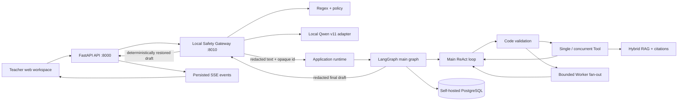

# EasyTeaching

EasyTeaching is a safety-aware teacher workflow assistant for Australian
early childhood education. It combines FastAPI, LangGraph, controlled tools,
local memory, retrieval-augmented generation (RAG), and a local Qwen privacy
gateway to turn educator requests into de-identified, reviewable drafts and
evidence-backed answers.

The repository is both a working local application and a learning project. All
example data must be synthetic, public, or thoroughly de-identified.

## What it does

- **One Main ReAct assistant** — handles planning, policy, documentation and
  family-draft requests without routing into fixed top-level specialists.
- **Activity planning drafts** — combines class context, EYLF evidence, safety
  checks and optional public context inside the same bounded loop.
- **Learning record drafts** — creates reviewable text only; saving is disabled
  in the current production graph.
- **Policy question answering with citations** — reuses the existing hybrid RAG
  evidence and source metadata.
- **Family communication drafts** — prepares reviewable wording without sending
  a real message.
- **Controlled research** — chooses one Tool, a concurrent Tool batch, or a
  bounded Worker batch for the current turn only.
- **Evidence-backed drafts** — reuses EYLF/policy RAG, citations, safety checks,
  scoped class context and public weather/resource tools.
- **Conversation continuity** — maintains LangGraph checkpoints, compact
  short-term context, and scoped long-term teacher/class memory.
- **Web workspace** — offers a ChatGPT-style local interface for sessions,
  messages, SSE progress events, draft display, and citations.
- **Local privacy and safety gateway** — combines deterministic rules with a
  Qwen2.5-1.5B QLoRA adapter before ReAct, then restores approved output using
  one-time opaque mappings owned by local Python code.

## System overview



One application-scoped runtime owns the SQLAlchemy store, PostgreSQL
checkpointer, and compiled graph. HTTP routes accept work and return quickly;
FastAPI then runs the accepted request asynchronously, persists its public
outcome, and publishes ordered events that the browser can replay over
Server-Sent Events (SSE).

In `enforce` mode the API calls the local gateway before it creates a
conversation run. ReAct, RAG, external model providers, logs, and LangGraph
checkpoints receive placeholders instead of detected personal information.
The gateway model only annotates; Python owns policy, blocking, placeholder
generation, mapping storage, and final restoration.

The Main assistant does not create a complete future plan. On each loop it
chooses only the next executable action: one Tool/MCP call, a concurrent batch
of independent Tools, a bounded fan-out of independent Workers, a clarification,
or the final draft. Code validates every decision before anything executes.

For a deeper walkthrough, see [Architecture](docs/architecture.md) and
[API and local operation](docs/api-and-operations.md). Important corrected
behaviors are recorded in [Engineering decisions](docs/engineering-decisions.md).

## Repository structure

```text
app/
  agents/       Main ReAct, decision validation, execution and Worker profiles
  api/          HTTP routes, runtime composition, execution and recovery
  schemas/      validated HTTP, graph, decision and observation contracts
  services/     persistence, models, retrieval, retries and domain services
  tools/        controlled tool definitions, permissions and handlers
  web/          local browser interface (HTML, CSS and JavaScript)
  workflows/    production Main ReAct graph and async PostgreSQL checkpointing

safety_gateway/ independent FastAPI process, Qwen loader, rules and mapping vault
data/
  knowledge/    tracked source manifest and processed public knowledge
  evals/        deterministic evaluation and reliability manifests
  chroma/       ignored local vector index

docs/           stable architecture and operating documentation
evals/          offline evaluation models, evaluators and runner
scripts/        named setup, demo, ingestion, evaluation and maintenance commands
tests/          committed unit, contract and integration regression coverage
```

This structure keeps delivery code under `app/`, offline quality measurement
under `evals/`, local operator commands under `scripts/`, and explanatory
material under `docs/`. The core modules were not moved merely for appearance;
their current imports already express useful boundaries.

The Local Privacy & Safety Gateway runtime lives under `safety_gateway/`; its
typed client and message-route integration live under `app/integrations/` and
`app/api/`. See [Local Safety Gateway](docs/local-safety-gateway.md) for the
process boundary, fail-closed behavior, and staged rollout plan.

## Quick start

Requires Python 3.9 or newer.

```bash
python3 -m venv .venv
source .venv/bin/activate
pip install -r requirements.txt
cp .env.example .env
```

Add your local model and embedding credentials to `.env`. Never commit that
file. Replace the PostgreSQL password placeholder in `POSTGRES_PASSWORD`,
`DATABASE_URL`, and `CHECKPOINT_DATABASE_URL` with the same long random value.

Start the self-hosted local PostgreSQL service and apply schema migrations:

```bash
docker compose up -d postgres
alembic upgrade head
```

Start the application:

```bash
uvicorn app.main:app --reload
```

Then open [http://127.0.0.1:8000](http://127.0.0.1:8000). API documentation is
available at [http://127.0.0.1:8000/docs](http://127.0.0.1:8000/docs), and the
health endpoint is `GET /health`.

The browser page uses the existing API; it does not bypass LangGraph or return
mock answers. It creates a durable session, submits a message, follows persisted
SSE workflow events and fetches the resulting draft. The production graph is
draft-only and exposes no approval, formal-write, or external-send route.

PostgreSQL is bound only to `127.0.0.1` in local development. SQLAlchemy owns
EasyTeaching operational and business tables; LangGraph's official `PostgresSaver`
owns its checkpoint tables in the same database. Chroma remains the separate
RAG vector store.

## Local privacy gateway (Windows + NVIDIA)

The gateway is a second local process in the same repository. It deliberately
uses its own `.venv-safety` because CUDA PyTorch, Transformers, PEFT, and
bitsandbytes are much heavier than the FastAPI application dependencies. Model
weights, adapters, secrets, and local gateway configuration are ignored by Git.

Create or refresh the gateway environment using model assets that already exist
on the machine (the command does not copy or upload them):

```powershell
.\scripts\setup_safety_gateway.ps1 `
  -ModelDir "C:\path\to\Qwen2.5-1.5B-Instruct" `
  -AdapterDir "C:\path\to\qlora-formal-v11\best-adapter"
```

Start the gateway in one terminal:

```powershell
.\scripts\start_safety_gateway.ps1
```

For the real application, set the local `.env` value below and start the main
FastAPI process separately. `disabled` remains the safe default until the
gateway is ready.

```dotenv
PRIVACY_GATEWAY_MODE=enforce
PRIVACY_GATEWAY_URL=http://127.0.0.1:8010
```

Run the synthetic-only one-command demonstration:

```powershell
.\scripts\demo_privacy_flow.ps1
```

The demo starts or reuses the real local Qwen gateway and prints the original
synthetic sentence, Qwen/rule decision, redacted GraphState input, placeholder
draft, restored FastAPI draft, and final run status. Its ReAct node is a
deterministic local substitute so the privacy integration can be demonstrated
without PostgreSQL or an external model-provider credential.

### Optional Supabase login

The local app remains authentication-free by default. To enable real email and
password login, create a free Supabase project, add or invite a user under
Authentication, and set these values in `.env`:

```bash
AUTH_ENABLED=true
SUPABASE_URL=https://your-project.supabase.co
SUPABASE_PUBLISHABLE_KEY=your-publishable-key
```

Restart the app and open the web workspace. Supabase validates the password;
FastAPI exchanges the resulting access token for an HTTP-only login cookie and
uses the trusted Supabase user ID as `teacher_id`. Authenticated users can only
open, message, stream, or read sessions that they own. Never put a
Supabase secret or service-role key in browser configuration.

## Knowledge setup

Prepare tracked source documents as chunks:

```bash
python scripts/ingest_knowledge.py \
  --output data/knowledge/processed/chunks.jsonl
```

Build the local Chroma index:

```bash
python scripts/build_vector_index.py --reset --batch-size 5
```

Query it directly:

```bash
python scripts/query_vector_index.py \
  "What does the EYLF say about play-based learning?" \
  --mode hybrid --top-k 5
```

The current retrieval stack supports dense, BM25, and hybrid search with an
optional cross-encoder reranker. Gemini creates 768-dimensional embeddings;
Chroma stores and searches them using cosine distance.

## API flow

The public workflow is deliberately small:

1. `POST /sessions` creates a conversation and LangGraph thread.
2. `POST /sessions/{session_id}/messages` accepts one idempotent request.
3. `GET /sessions/{session_id}/events?request_id=...` streams ordered progress
   events using SSE.
4. `GET /sessions/{session_id}/drafts/{request_id}` returns the public draft
   and citations.

SSE currently streams workflow lifecycle events, not individual LLM tokens.
That distinction keeps replay and reconnect behavior deterministic: events are
stored first, then delivered from a sequence cursor.

## Safety boundaries

EasyTeaching is a teacher assistant. It **must not**:

- Diagnose children
- Provide medical advice
- Provide legal compliance conclusions
- Send real messages to families
- expose raw real child or family private information to a model

| Risk | Typical capability | Behavior |
| --- | --- | --- |
| L0 read-only | Search policy or read synthetic class context | Execute and record evidence |
| L1 draft | Generate an activity, record, or communication draft | Mark clearly as a draft |
| L2 controlled write | Save or overwrite a record | Require scoped teacher approval |
| L3 forbidden or handoff | Sending, diagnosis, medical/legal judgment, raw PII | Refuse or hand off |

The current production graph never performs a controlled write or real-world
side effect. A model never receives arbitrary Python functions: Tool and Worker
names are registered in code with validated schemas, risk levels, allowlists,
timeouts, dependency checks and trusted teacher/class execution scope.
Human approval is required before any future controlled write is re-enabled;
the current draft-only graph never reaches that boundary.

### Privacy gateway contract

The local adapter returns strict JSON annotations for injection risk, education
scope, professional boundary, and exact PII values (`PERSON_NAME`, `PHONE`,
`EMAIL`, `ADDRESS`, and `DOB`). It does **not** redact text, choose placeholders,
store mappings, restore names, grant permissions, or perform a write. Those
operations remain deterministic Python responsibilities.

Input modes are explicit:

| Mode | Intended use | Behavior |
| --- | --- | --- |
| `disabled` | Default/bootstrap | Do not call the gateway |
| `shadow` | Synthetic local diagnostics only | Inspect, discard mappings, forward original text |
| `enforce` | Integrated local gateway | Fail closed; only allowed redacted text reaches ReAct |

The current mapping vault is memory-only, single-process, one-time-use, and
TTL-bound. That is appropriate for this local demonstration, but a gateway
restart can invalidate an in-flight mapping. Encrypted durable mapping storage,
deployment key management, retention controls, and a formal privacy review are
required before any real-data deployment.

The v11 adapter's frozen synthetic test set contained 1,050 records. It achieved
PII F1 `0.947`, injection/scope/professional joint risk accuracy values reported
separately (`0.910` / `0.957` / `0.907`), and strict JSON plus deterministic
resolution validity `0.963`. These are synthetic benchmark results, not claims
of production safety or performance on real children, families, or educators.

## Testing and evaluation

Run the complete automated suite:

```bash
python -m pytest
```

Run the 30-case agent evaluation:

```bash
python scripts/run_evals.py
python scripts/run_evals.py --live-model
```

Run deterministic reliability and failure-injection checks:

```bash
python scripts/run_reliability_checks.py
```

Run one question through the real configured model and the production
PostgreSQL-backed Main ReAct path:

```bash
python scripts/ask_live.py \
  "What does the EYLF say about play-based learning?" \
  --trace
```

This command persists a synthetic terminal-demo session in the local database
and prints the final draft, citations, and optional execution trace.

Latest checks relevant to the local privacy integration:

| Check | Result |
| --- | --- |
| Frozen synthetic v11 generation test | 1,050 records evaluated |
| PII overall precision / recall / F1 | `0.991` / `0.906` / `0.947` |
| Strict JSON + deterministic resolution validity | `0.963` |
| Privacy/API targeted regression suite | 41 passed |
| Real Qwen-to-FastAPI synthetic demo | Passed |

Automated tests are intentionally committed source code, not generated output.
They document contracts and protect fail-closed behavior during refactoring.
Generated caches, reports, logs, local databases, environments, model weights,
adapters, and secrets are excluded through `.gitignore`.

The evaluation suite retains component-level routing checks and now exercises
the production Main ReAct trajectory for single Tool, concurrent Tool,
dependency, parallel Worker and clarification paths. Reliability scenarios
exercise retryable model failures, non-retryable failures, structured-output
repair, fallback responses, and observable API failure events. Evaluation data
is development-only and is not part of the production API response path.

## Current status and known gaps

Completed work includes the unified Main ReAct production graph, controlled
single/concurrent tools, bounded Worker fan-out/fan-in, hybrid RAG, checkpointed
context and memory, draft-only execution, idempotent FastAPI routes, SSE replay,
offline evaluation, retries, fallbacks, and fault validation. The former
Specialist, Skill and approval execution paths have been removed. Historical
database columns remain until an explicit, data-safe Alembic migration removes
them.

Known follow-up work:

- improve RAG recall and source-selection quality for the remaining evaluation
  misses;
- replace the single-process in-memory mapping vault with encrypted durable
  storage before any real-data or multi-instance deployment;
- evaluate the safety adapter on independently authored, governance-approved
  de-identified data before making production claims;
- run a real PostgreSQL migration and API smoke test when Docker is available;
- remove historical database compatibility columns only through a backed-up,
  reversible Alembic migration;
- add true token streaming only if the model provider and product experience
  justify the added complexity;
- keep WebSocket support out until bidirectional real-time interaction is
  actually needed.

## Design principles

- **Validated boundaries:** Pydantic contracts guard HTTP, graph, Main decision,
  Worker observation, Tool, and evaluation interfaces.
- **Least privilege:** Main sees registered read-only capabilities; each Worker
  receives a smaller domain-specific allowlist and step budget.
- **Draft-only boundary:** the production graph cannot save, send, approve or
  perform another side effect.
- **Replayable execution:** checkpointed graph state and persisted SSE events
  support safe recovery and reconnection.
- **Inspectable quality:** evaluations report per-capability results instead of
  hiding failures inside one aggregate score.

## License

The source code is available under the [MIT License](LICENSE).

The license does not make the example application production-ready. Any real
deployment still requires privacy review, security controls, a data-retention
policy, and organisation-specific governance. Use only synthetic, public, or
thoroughly de-identified education data while developing locally.
