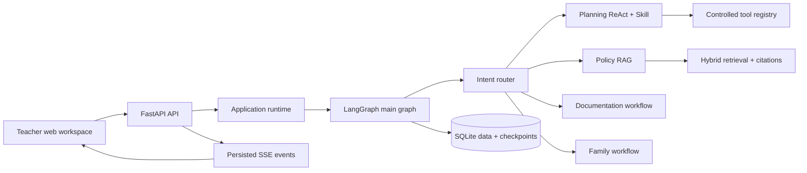

# EduFlow AU Agent

EduFlow AU Agent is a safety-aware teacher workflow assistant for Australian
early childhood education. It combines FastAPI, LangGraph, controlled tools,
local memory, and retrieval-augmented generation (RAG) to turn educator
requests into reviewable drafts and evidence-backed answers.

The repository is both a working local application and a learning project. All
example data must be synthetic, public, or thoroughly de-identified.

## What it does

- **Activity planning drafts** — creates structured, EYLF-aligned activity
  plans after loading a trusted planning Skill and running safety checks.
- **Learning record drafts** — de-identifies observations before model use and
  pauses controlled writes for teacher approval.
- **Policy question answering with citations** — retrieves policy evidence and
  returns grounded answers with source metadata.
- **Family communication drafts** — provides the specialist boundary for
  reviewable family-facing drafts; this remains intentionally lightweight.
- **Conversation continuity** — maintains LangGraph checkpoints, compact
  short-term context, and scoped long-term teacher/class memory.
- **Web workspace** — offers a ChatGPT-style local interface for sessions,
  messages, SSE progress events, draft display, citations, and approvals.

## System overview



One application-scoped runtime owns the SQLAlchemy store, SQLite checkpointer,
and compiled graph. HTTP routes accept work and return quickly; background
execution runs the graph, persists its public outcome, and publishes ordered
events that the browser can replay over Server-Sent Events (SSE).

For a deeper walkthrough, see [Architecture](docs/architecture.md) and
[API and local operation](docs/api-and-operations.md). Important corrected
behaviors are recorded in [Engineering decisions](docs/engineering-decisions.md).

## Repository structure

```text
app/
  agents/       model-facing router and ReAct orchestration
  api/          HTTP routes, runtime composition, execution and recovery
  schemas/      validated contracts shared across boundaries
  services/     persistence, models, retrieval, retries and domain services
  skills/       trusted file-based specialist instructions
  tools/        controlled tool definitions, permissions and handlers
  web/          local browser interface (HTML, CSS and JavaScript)
  workflows/    main and specialist LangGraph workflows

data/
  knowledge/    tracked source manifest and processed public knowledge
  evals/        deterministic evaluation and reliability manifests
  local/        ignored runtime SQLite files
  chroma/       ignored local vector index

docs/           stable architecture and operating documentation
evals/          offline evaluation models, evaluators and runner
scripts/        local demos, ingestion, evaluation and maintenance entry points
tests/          unit and integration coverage
```

This structure keeps delivery code under `app/`, offline quality measurement
under `evals/`, local operator commands under `scripts/`, and explanatory
material under `docs/`. The core modules were not moved merely for appearance;
their current imports already express useful boundaries.

## Quick start

Requires Python 3.9 or newer.

```bash
python3 -m venv .venv
source .venv/bin/activate
pip install -r requirements.txt
cp .env.example .env
```

Add your local model and embedding credentials to `.env`. Never commit that
file.

Start the application:

```bash
uvicorn app.main:app --reload
```

Then open [http://127.0.0.1:8000](http://127.0.0.1:8000). API documentation is
available at [http://127.0.0.1:8000/docs](http://127.0.0.1:8000/docs), and the
health endpoint is `GET /health`.

The browser page uses the existing API; it does not bypass LangGraph or return
mock answers. It creates a durable session, submits a message, follows persisted
SSE workflow events, fetches the resulting draft, and shows approval controls
when the graph pauses.

## Knowledge setup

Prepare tracked source documents as chunks:

```bash
python scripts/ingest_knowledge.py \
  --output data/knowledge/processed/chunks.jsonl
```

Build the local Chroma index:

```bash
python scripts/build_vector_index.py --reset --batch-size 5
```

Query it directly:

```bash
python scripts/query_vector_index.py \
  "What does the EYLF say about play-based learning?" \
  --mode hybrid --top-k 5
```

The current retrieval stack supports dense, BM25, and hybrid search with an
optional cross-encoder reranker. Gemini creates 768-dimensional embeddings;
Chroma stores and searches them using cosine distance.

## API flow

The public workflow is deliberately small:

1. `POST /sessions` creates a conversation and LangGraph thread.
2. `POST /sessions/{session_id}/messages` accepts one idempotent request.
3. `GET /sessions/{session_id}/events?request_id=...` streams ordered progress
   events using SSE.
4. `GET /sessions/{session_id}/drafts/{request_id}` returns the public draft,
   approval state, and citations.
5. `POST /sessions/{session_id}/approvals` resumes a graph paused for an
   `approve` or `reject` decision.

SSE currently streams workflow lifecycle events, not individual LLM tokens.
That distinction keeps replay and reconnect behavior deterministic: events are
stored first, then delivered from a sequence cursor.

## Safety boundaries

EduFlow is a teacher assistant. It **must not**:

- Diagnose children
- Provide medical advice
- Provide legal compliance conclusions
- Send real messages to families
- expose raw real child or family private information to a model

| Risk | Typical capability | Behavior |
| --- | --- | --- |
| L0 read-only | Search policy or read synthetic class context | Execute and record evidence |
| L1 draft | Generate an activity, record, or communication draft | Mark clearly as a draft |
| L2 controlled write | Save or overwrite a record | Require scoped teacher approval |
| L3 forbidden or handoff | Sending, diagnosis, medical/legal judgment, raw PII | Refuse or hand off |

Human approval is required before any controlled write or real-world side
effect. A model never receives direct access to arbitrary Python functions:
tools are registered with validated input/output schemas, risk levels, and
specialist-specific permissions.

## Testing and evaluation

Run the complete automated suite:

```bash
python -m pytest
```

Run the 30-case agent evaluation:

```bash
python scripts/run_evals.py
python scripts/run_evals.py --live-model
```

Run deterministic reliability and failure-injection checks:

```bash
python scripts/run_reliability_checks.py
```

The evaluation suite covers routing, tool use, RAG, memory, safety, and graph
trajectory. Reliability scenarios exercise retryable model failures,
non-retryable failures, structured-output repair, fallback responses, and
observable API failure events. Evaluation data is development-only and is not
part of the production API response path.

## Current status and known gaps

Completed work includes the agent foundation, controlled tools, hybrid RAG,
checkpointed memory, specialist contracts and permissions, the Planning Skill,
documentation redaction, interrupt/resume approval, idempotent FastAPI routes,
SSE event replay, offline evaluation, retries, fallbacks, and fault validation.

Known follow-up work:

- improve RAG recall and source-selection quality for the remaining evaluation
  misses;
- add stronger privacy-session handling for real multi-turn learning records;
- complete the final Week 4 production-readiness tasks;
- add true token streaming only if the model provider and product experience
  justify the added complexity;
- keep WebSocket support out until bidirectional real-time interaction is
  actually needed.

## Design principles

- **Validated boundaries:** Pydantic contracts guard HTTP, graph, specialist,
  tool, and evaluation interfaces.
- **Least privilege:** each specialist receives only its explicit tool allowlist
  and step budget.
- **Human control:** approval is a scoped authorization decision, not decoration
  after an unrestricted action.
- **Replayable execution:** checkpointed graph state and persisted SSE events
  support safe recovery and reconnection.
- **Inspectable quality:** evaluations report per-capability results instead of
  hiding failures inside one aggregate score.

## License and data note

This repository is currently an educational portfolio project. Before any
production deployment, add the appropriate license, privacy review, security
controls, data-retention policy, and organisation-specific governance.
