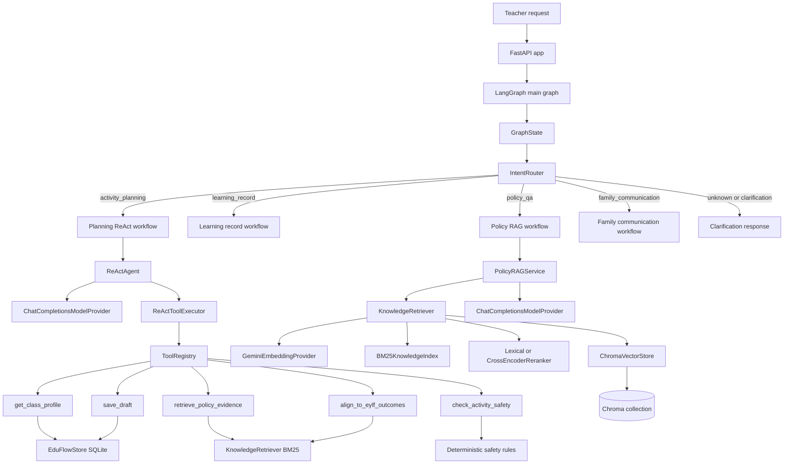
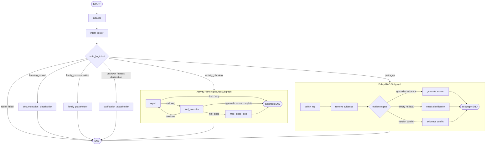
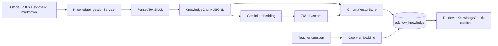

# EduFlow AU Agent

EduFlow AU Agent is a learning project for building a teacher workflow agent
for Australian early childhood education scenarios. The current codebase
focuses on a runnable, testable agent backbone: intent routing, controlled
tools, ReAct execution, document ingestion, embeddings, and a local vector
index for RAG.

All project data should be synthetic, public, or thoroughly de-identified.

## Product Scope

The agent supports teacher-assistant workflows for:

- Activity planning drafts
- Learning record drafts
- Policy question answering with citations
- Family communication drafts

The agent may draft, search, and reason, but code-level validation controls
which tools can run, which writes require approval, and which actions are
forbidden.

## Architecture



## LangGraph Flow



## Knowledge Pipeline



Current vector index settings:

```text
index_method=hnsw
distance_metric=cosine
embedding_model_name=gemini-embedding-001
embedding_dimension=768
collection_name=eduflow_knowledge
```

Gemini creates embeddings. Chroma stores those vectors and uses HNSW with
cosine distance to retrieve semantically similar chunks.

## Key Modules

```text
app/main.py
  FastAPI entry point and /health endpoint.

app/config.py
  Runtime settings loaded from .env.

app/schemas/
  Pydantic models for graph state, intent routing, ReAct decisions, and
  knowledge chunks/citations.

app/workflows/
  LangGraph workflows. The main graph routes requests by intent and connects
  activity planning to the ReAct workflow.

app/agents/
  IntentRouter, ReActAgent, and ReActToolExecutor orchestration logic.

app/tools/
  ToolDefinition, ToolResult, ToolRegistry, and controlled tools.

app/services/
  Model provider, embedding provider, SQLAlchemy store, knowledge ingestion,
  and Chroma vector store.

data/knowledge/
  Source manifest, raw knowledge documents, and processed chunks JSONL.

scripts/
  Local smoke tests and utility scripts for ingestion, model calls, and vector
  index building.

tests/
  Unit and integration tests for the agent backbone.
```

## Safety Boundaries

EduFlow AU is a teacher assistant. It must not:

- Diagnose children
- Provide medical advice
- Provide legal compliance conclusions
- Send real messages to families
- Use raw real child or family private information

### Risk Levels

| Level | Typical action | System behavior |
| --- | --- | --- |
| L0 read-only | Search policy text, read synthetic class configuration | Execute automatically and record sources |
| L1 draft | Generate activity plans, learning records, or family message drafts | Execute automatically, clearly marked as Draft |
| L2 controlled write | Save, overwrite, or export records | Show the change and require teacher confirmation |
| L3 forbidden or handoff | Real sending, diagnosis, medical/legal judgment, raw PII | Refuse or hand off with a clear boundary explanation |

Human approval is required before any controlled write or real-world side
effect. Approval is treated as a scoped authorization boundary, not as a casual
review step after unrestricted model behavior.

## Tool System

Tools are not plain functions exposed directly to the model. Each tool is
described by a `ToolDefinition` with:

- `name`
- `description`
- `category`
- Pydantic `input_model`
- Pydantic `output_model`
- `risk_level`
- `permission`
- `handler`

The `ToolRegistry` is the code-level boundary between model intent and tool
execution. It handles duplicate tool names, tool lookup, Pydantic validation,
approval checks, forbidden-tool blocking, handler exception wrapping, and
structured `ToolResult` output.

Current controlled tools:

| Tool | Risk | Permission | Purpose |
| --- | --- | --- | --- |
| `get_class_profile` | L0 read-only | Auto execute | Read synthetic class profile data |
| `retrieve_policy_evidence` | L0 read-only | Auto execute | Retrieve citable local policy evidence |
| `check_activity_safety` | L0 read-only | Auto execute | Check activity drafts for common safety risks |
| `align_to_eylf_outcomes` | L0 read-only | Auto execute | Map activity drafts to likely EYLF outcomes with evidence |
| `save_draft` | L2 controlled write | Requires approval | Save a draft record with an idempotency key |

## Local Setup

Create and activate a virtual environment:

```bash
python3 -m venv .venv
source .venv/bin/activate
```

Install dependencies:

```bash
pip install -r requirements.txt
```

Copy local environment variables:

```bash
cp .env.example .env
```

The real API key belongs only in `.env`, which is ignored by Git.

Required model and embedding settings:

```text
MODEL_BASE_URL
MODEL_CHAT_COMPLETIONS_PATH
MODEL_API_KEY
MODEL_NAME
MODEL_TIMEOUT_SECONDS

EMBEDDING_BASE_URL
EMBEDDING_API_KEY
EMBEDDING_MODEL_NAME
EMBEDDING_DIMENSION
EMBEDDING_TIMEOUT_SECONDS

CHROMA_PATH
CHROMA_COLLECTION_NAME
```

## Run Commands

Run tests:

```bash
python -m pytest
```

Run the API locally:

```bash
uvicorn app.main:app --reload
```

Check the health endpoint:

```bash
curl http://127.0.0.1:8000/health
```

Run model smoke tests:

```bash
python scripts/model_smoke_test.py
python scripts/intent_router_smoke_test.py
python scripts/gemini_week1_trace.py
```

Ingest knowledge sources into chunks:

```bash
python scripts/ingest_knowledge.py --output data/knowledge/processed/chunks.jsonl
```

Build a small vector index smoke test:

```bash
python scripts/build_vector_index.py --reset --limit 5 --batch-size 5
```

Continue building the full vector index without deleting existing chunks:

```bash
python scripts/build_vector_index.py --batch-size 4 --max-retries 10 --retry-delay-seconds 15 --batch-delay-seconds 3
```

Use `--reset` only when you intentionally want to delete and recreate the
configured Chroma collection.

Query the local vector index:

```bash
python scripts/query_vector_index.py "What does the EYLF say about play-based learning?" --top-k 5
```

Query with BM25 or hybrid retrieval:

```bash
python scripts/query_vector_index.py "play based learning" --mode bm25 --top-k 5
python scripts/query_vector_index.py "play based learning" --mode hybrid --reranker cross_encoder --top-k 5
```

Run the policy RAG main-graph smoke test:

```bash
python scripts/policy_rag_smoke_test.py
python scripts/policy_rag_smoke_test.py --real-model --reranker cross_encoder
```

Run real LLM policy RAG and print the final answer:

```bash
python scripts/real_policy_rag_answer.py "What does the EYLF say about play-based learning?"
```

## Local Data

Ignored local runtime data:

```text
.env
data/local/
data/chroma/
```

Tracked knowledge inputs and processed chunks live under:

```text
data/knowledge/
```
