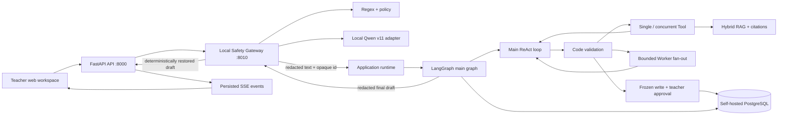

# EasyTeaching

EasyTeaching is a safety-aware AI agent for Australian early childhood
educators. It answers questions, retrieves EYLF/NQS and centre-policy evidence,
creates and revises teaching drafts, works with authorised records, and prepares
controlled actions for teacher approval. The implementation combines FastAPI,
LangGraph ReAct, validated Tools and Workers, PostgreSQL, hybrid RAG, memory, and
an experimental local Qwen privacy gateway.

The repository contains the complete local application, infrastructure
configuration, migrations, evaluation suites, and operational documentation.
Development and evaluation data must be synthetic, public, or thoroughly
de-identified.

## Project status

The current release implements the complete local application path: browser UI,
FastAPI, PostgreSQL, LangGraph ReAct, controlled Tools and Workers, hybrid RAG,
approvals, record export, optional Google Drive MCP, evaluation, and an
experimental local privacy gateway.

The final live Agent evaluation passed `39/40` scenarios (`97.5%`); the only
failed assertion was corrected and its isolated rerun passed. The independent
local privacy-gateway evaluation did **not** pass its release gate because the
fine-tuned model and deterministic premasking pipeline have a training/serving
distribution mismatch. Keep `PRIVACY_GATEWAY_MODE=disabled` and use only
synthetic or thoroughly de-identified data unless that model is retrained and
re-evaluated. See [Agent evaluation](docs/agent-evaluation.md) and
[Local Safety Gateway](docs/local-safety-gateway.md). The final completed versus
out-of-scope boundary is listed in [Project status](docs/project-status.md).

## What it does

- **One Main ReAct assistant** — handles planning, policy, documentation and
  family-draft requests without routing into fixed top-level specialists.
- **Activity planning drafts** — combines class context, EYLF evidence, safety
  checks and optional public context inside the same bounded loop.
- **Observation and educational records** — organises incomplete notes, creates
  reviewable drafts, and saves only a frozen teacher-approved payload.
- **Policy question answering with citations** — reuses the existing hybrid RAG
  evidence and source metadata.
- **Family communication drafts** — prepares reviewable wording without sending
  a real message.
- **Controlled research** — chooses one Tool, a concurrent Tool batch, or a
  bounded Worker batch for the current turn only.
- **Evidence-backed drafts** — reuses EYLF/policy RAG, citations, safety checks,
  scoped class context and date-aware weather/holiday context.
- **Conversation continuity** — maintains LangGraph checkpoints, compact
  short-term context, and scoped long-term teacher/class memory.
- **Web workspace** — offers a ChatGPT-style local interface for sessions,
  messages, SSE progress events, draft display, citations, and approve/reject
  cards for frozen controlled writes.
- **Optional Google Drive MCP** — searches the teacher's authorised Drive and
  uploads only approved, locally managed record exports.
- **Local privacy and safety gateway** — combines deterministic rules with a
  Qwen2.5-1.5B QLoRA adapter before ReAct, then restores approved output using
  one-time opaque mappings owned by local Python code.

## System overview



One application-scoped runtime owns the SQLAlchemy store, PostgreSQL
checkpointer, and compiled graph. HTTP routes accept work and return quickly;
FastAPI then runs the accepted request asynchronously, persists its public
outcome, and publishes ordered events that the browser can replay over
Server-Sent Events (SSE).

In `enforce` mode the API calls the local gateway before it creates a
conversation run. ReAct, RAG, external model providers, logs, and LangGraph
checkpoints receive placeholders instead of detected personal information.
The gateway model only annotates; Python owns policy, blocking, placeholder
generation, mapping storage, and final restoration.

The Main assistant does not create a complete future plan. On each loop it
chooses only the next executable action: one Tool/MCP call, a concurrent batch
of independent Tools, a bounded fan-out of independent Workers, a clarification,
or the final draft. Each structured decision may report a semantic `task_type`
for logs and evaluation, but the graph neither locks it nor uses it for routing.
A separate narrow safety flag protects proposed activities; code validates Tool
permissions, approvals, conflicts and budgets before anything executes.

For a deeper walkthrough, see [Architecture](docs/architecture.md) and
[API and local operation](docs/api-and-operations.md). Important corrected
behaviors are recorded in [Engineering decisions](docs/engineering-decisions.md).
The current Tool, Worker and database boundaries are summarised in
[Tool and Worker architecture](docs/tool-architecture.md). Retrieval
design and measurements are documented in [RAG system](docs/rag-system.md).

## Repository structure

```text
app/
  agents/       Main ReAct, decision validation, execution and Worker profiles
  api/          HTTP routes, runtime composition, execution and recovery
  schemas/      validated HTTP, graph, decision and observation contracts
  services/     persistence, models, retrieval, retries and domain services
  tools/        controlled tool definitions, permissions and handlers
  web/          local browser interface (HTML, CSS and JavaScript)
  workflows/    production Main ReAct graph and async PostgreSQL checkpointing

safety_gateway/ independent FastAPI process, Qwen loader, rules and mapping vault
data/
  knowledge/    tracked source manifest and processed public knowledge
  evals/        deterministic evaluation and reliability manifests
  chroma/       ignored local vector index

docs/           stable architecture and operating documentation
evals/          offline evaluation models, evaluators and runner
scripts/        setup, verification, ingestion, evaluation and maintenance commands
tests/          committed unit, contract and integration regression coverage
```

This structure keeps delivery code under `app/`, offline quality measurement
under `evals/`, local operator commands under `scripts/`, and explanatory
material under `docs/`. The core modules were not moved merely for appearance;
their current imports already express useful boundaries.

The Local Privacy & Safety Gateway runtime lives under `safety_gateway/`; its
typed client and message-route integration live under `app/integrations/` and
`app/api/`. See [Local Safety Gateway](docs/local-safety-gateway.md) for the
process boundary, fail-closed behavior, and staged rollout plan.

## Quick start

Requires Python 3.10 or newer, Docker Desktop, and API credentials for the chat
and embedding providers. Google Drive and the local privacy gateway are optional.

### Windows PowerShell

```powershell
py -m venv .venv
.\.venv\Scripts\Activate.ps1
python -m pip install -r requirements.txt
Copy-Item .env.example .env
docker compose up -d postgres
.\.venv\Scripts\alembic.exe upgrade head
.\.venv\Scripts\python.exe scripts\run_api.py
```

### macOS / Linux

```bash
python3 -m venv .venv
source .venv/bin/activate
pip install -r requirements.txt
cp .env.example .env
docker compose up -d postgres
alembic upgrade head
python scripts/run_api.py
```

Before starting the API, edit `.env`: use the same long local password in
`POSTGRES_PASSWORD`, `DATABASE_URL`, and `CHECKPOINT_DATABASE_URL`, then add the
chat and embedding credentials. Never commit `.env`. The `run_api.py` wrapper
selects a psycopg-compatible event loop on Windows.

Then open [http://127.0.0.1:8000](http://127.0.0.1:8000). API documentation is
available at [http://127.0.0.1:8000/docs](http://127.0.0.1:8000/docs), and the
health endpoint is `GET /health`.

The browser page uses the same Agent API; it does not bypass LangGraph or return
mock answers. It creates a durable session, submits a message, follows persisted
SSE Agent-run events and fetches the resulting answer or draft. Controlled writes
use the approval API; external sending remains unavailable.

PostgreSQL is bound only to `127.0.0.1` in local development. SQLAlchemy owns
EasyTeaching operational and business tables; LangGraph's official `PostgresSaver`
owns its checkpoint tables in the same database. Chroma remains the separate
RAG vector store.

## Local privacy gateway (Windows NVIDIA + Apple Silicon Mac)

The gateway is a second local process in the same repository. It deliberately
uses its own `.venv-safety` because PyTorch, Transformers, PEFT, and the model
runtime are much heavier than the FastAPI application dependencies. Model
weights, adapters, secrets, and local gateway configuration are ignored by Git.

`SAFETY_MODEL_BACKEND=auto` selects NVIDIA CUDA first and Apple MPS second. The
Windows/NVIDIA path uses bitsandbytes 4-bit quantization. The Apple Silicon path
loads the same Qwen base model and the same LoRA adapter in FP16 through PyTorch
MPS, so it does not require a second training run. The gateway fails closed if
neither supported accelerator is available.

### Windows with NVIDIA

Create or refresh the gateway environment using model assets that already exist
on the machine (the command does not copy or upload them):

```powershell
.\scripts\setup_safety_gateway.ps1 `
  -ModelDir "C:\path\to\Qwen2.5-1.5B-Instruct" `
  -AdapterDir "C:\path\to\qlora-formal-v11\best-adapter"
```

Start the gateway in one terminal:

```powershell
.\scripts\start_safety_gateway.ps1
```

For the real application, set the local `.env` value below and start the main
FastAPI process separately. `disabled` remains the safe default until the
gateway is ready.

```dotenv
PRIVACY_GATEWAY_MODE=enforce
PRIVACY_GATEWAY_URL=http://127.0.0.1:8010
```

Run the synthetic end-to-end verification:

```powershell
.\scripts\demo_privacy_flow.ps1
```

### Apple Silicon Mac

Python 3.10+ and Apple Silicon are required. A 16 GB Mac is recommended; FP16
inference usually needs roughly 4–6 GB of unified memory including runtime
overhead. Keep the base-model and adapter files local, then run:

```bash
bash ./scripts/setup_safety_gateway.sh \
  /path/to/Qwen2.5-1.5B-Instruct \
  /path/to/qlora-formal-v11/best-adapter
bash ./scripts/start_safety_gateway.sh
```

In a separate terminal, run the synthetic full-flow verification:

```bash
bash ./scripts/demo_privacy_flow.sh
```

Training can remain on the Windows NVIDIA machine; only inference moves to MPS.
Backend selection is covered by automated tests, but the MPS path still needs a
one-time smoke test on the target Mac because Windows cannot execute Metal code.

The verification command starts or reuses the real local Qwen gateway and prints the original
synthetic sentence, Qwen/rule decision, redacted GraphState input, placeholder
draft, restored FastAPI draft, and final run status. Its ReAct node is a
deterministic local substitute so the privacy integration can be verified
without PostgreSQL or an external model-provider credential.

### Optional Supabase login

The local app remains authentication-free by default. To enable real email and
password login, create a free Supabase project, add or invite a user under
Authentication, and set these values in `.env`:

```bash
AUTH_ENABLED=true
SUPABASE_URL=https://your-project.supabase.co
SUPABASE_PUBLISHABLE_KEY=your-publishable-key
```

Restart the app and open the web workspace. Supabase validates the password;
FastAPI exchanges the resulting access token for an HTTP-only login cookie and
uses the trusted Supabase user ID as `teacher_id`. Authenticated users can only
open, message, stream, or read sessions that they own. Never put a
Supabase secret or service-role key in browser configuration.

## Knowledge setup

Prepare tracked source documents as chunks:

```bash
python scripts/ingest_knowledge.py \
  --output data/knowledge/processed/chunks.jsonl
```

PDFs are parsed with PyMuPDF4LLM's layout-aware path and OCR is disabled for
the current text-based sources. Chunking follows headings and paragraphs with
an approximate 350-token target, 500-token maximum and 40-token overlap.

Build the persistent SQLite FTS5/BM25 index (no model API is used):

```bash
python scripts/build_lexical_index.py
```

Build the local Chroma index:

```bash
python scripts/build_vector_index.py --reset --batch-size 5
```

Query it directly:

```bash
python scripts/query_vector_index.py \
  "What does the EYLF say about play-based learning?" \
  --mode hybrid --top-k 5
```

The retrieval stack uses Chroma dense search plus a persistent SQLite FTS5
BM25 index, then combines their ranks with weighted reciprocal-rank fusion.
The fast baseline does not rerank. The enhanced path applies a local
Cross-encoder to the fused shortlist, then blends its rank with the trusted
Hybrid rank (2:1) so semantic reranking cannot easily discard strong exact
matches. Gemini creates 768-dimensional embeddings and Chroma searches them
with cosine distance. Building or querying the dense index consumes embedding
API quota; ingestion and BM25 indexing do not.

The Agent exposes one knowledge boundary, `retrieve_knowledge`, with two modes:

- `mode=standard` performs one focused hybrid retrieval and is the default.
- `mode=deep` uses one chat-model call to rewrite a broad question, retrieves
  several queries, applies a second RRF pass, then uses the local Cross-encoder.
  It is reserved for genuinely complex research because it costs more.

## API interaction

The public API is deliberately small:

1. `POST /sessions` creates a conversation and LangGraph thread.
2. `POST /sessions/{session_id}/messages` accepts one idempotent request.
3. `GET /sessions/{session_id}/events?request_id=...` streams ordered progress
   events using SSE.
4. `GET /sessions/{session_id}/drafts/{request_id}` returns the public draft
   and citations.
5. `POST /sessions/{session_id}/approvals` approves or rejects one frozen
   controlled-write action. Approval never lets the model alter the reviewed
   arguments.

SSE currently streams Agent-run lifecycle events, not individual LLM tokens.
That distinction keeps replay and reconnect behavior deterministic: events are
stored first, then delivered from a sequence cursor.

## Safety boundaries

EasyTeaching is a teacher assistant. It **must not**:

- Diagnose children
- Provide medical advice
- Provide legal compliance conclusions
- Send real messages to families
- expose raw real child or family private information to a model

| Risk | Typical capability | Behavior |
| --- | --- | --- |
| L0 read-only | Search policy or read synthetic class context | Execute and record evidence |
| L1 draft | Generate an activity, record, or communication draft | Mark clearly as a draft |
| L2 controlled write | Save or overwrite a record | Require scoped teacher approval |
| L3 forbidden or handoff | Sending, diagnosis, medical/legal judgment, raw PII | Refuse or hand off |

The production graph can prepare observation, educational-record and export
writes, but it never performs them during model generation. It freezes the
validated arguments, pauses with an exact preview, and executes that frozen
action only after teacher approval. Human approval is required for every L2
controlled write. A model never receives arbitrary Python
functions: Tool and Worker names are registered in code with validated schemas,
risk levels, allowlists, timeouts and trusted teacher/class execution scope.

### Privacy gateway contract

The local adapter returns strict JSON annotations for injection risk, education
scope, professional boundary, and exact PII values (`PERSON_NAME`, `PHONE`,
`EMAIL`, `ADDRESS`, and `DOB`). It does **not** redact text, choose placeholders,
store mappings, restore names, grant permissions, or perform a write. Those
operations remain deterministic Python responsibilities.

Input modes are explicit:

| Mode | Intended use | Behavior |
| --- | --- | --- |
| `disabled` | Default/bootstrap | Do not call the gateway |
| `shadow` | Synthetic local diagnostics only | Inspect, discard mappings, forward original text |
| `enforce` | Integrated local gateway | Fail closed; only allowed redacted text reaches ReAct |

The current mapping vault is memory-only, single-process, one-time-use, and
TTL-bound. That is appropriate for the current local runtime, but a gateway
restart can invalidate an in-flight mapping. Encrypted durable mapping storage,
deployment key management, retention controls, and a formal privacy review are
required before any real-data deployment.

The frozen direct-model v11 test reported PII F1 `0.947`, but the more important
240-case deployed-pipeline test exposed the premasking mismatch: PII F1 `0.750`,
Gateway success `92.5%`, phone recall `0%`, and release gate **failed**. The
Gateway still failed closed and leaked no plaintext in responses. These are
synthetic results and are not claims of safety on real children, families, or
educators.

## Testing and evaluation

Run the complete automated suite:

```bash
python -m pytest
```

Run the zero-provider-cost structural suite:

```bash
python scripts/run_evals.py
```

Run the independent 40-scenario production-path Agent evaluation (uses Gemini
and embedding quota):

```bash
python scripts/run_final_agent_suite.py \
  --output reports/final_agent_evaluation.json
```

Run the frozen retrieval-only RAG evaluation:

```bash
python scripts/run_rag_evals.py \
  --cases data/evals/rag_final_cases.json \
  --split test --modes bm25 dense hybrid \
  --report reports/rag_final_report.json
```

Run deterministic reliability and failure-injection checks:

```bash
python scripts/run_reliability_checks.py
```

Run one question through the real configured model and the production
PostgreSQL-backed Main ReAct path:

```bash
python scripts/ask_live.py \
  "What does the EYLF say about play-based learning?" \
  --trace
```

This command persists a synthetic verification session in the local database
and prints the final draft, citations, and optional execution trace.

Latest final checks:

| Check | Result |
| --- | --- |
| Repository regression suite | `329/329` passed |
| Live Agent scenarios | `39/40 (97.5%)`; corrected isolated rerun `1/1` |
| Required-Tool recall / Tool precision | `100.0%` / `95.8%` |
| RAG, security, multi-turn, approval integrity | `100%` in the final suite |
| ReAct steps P50 / P95 / max | `2 / 4 / 4` |
| Agent latency P50 / P95 | `3.46 s / 11.68 s` |
| Local privacy Gateway release gate | **Failed** |
| Gateway PII precision / recall / F1 | `100% / 60% / 75%` |

Automated tests are intentionally committed source code, not generated output.
They document contracts and protect fail-closed behavior during refactoring.
Generated caches, reports, logs, local databases, environments, model weights,
adapters, and secrets are excluded through `.gitignore`.

The evaluation suite retains component-level routing checks and now exercises
the production Main ReAct trajectory for single Tool, concurrent Tool,
sequential dependent work, parallel Worker and clarification paths. Reliability scenarios
exercise retryable model failures, non-retryable failures, structured-output
repair, fallback responses, and observable API failure events. Evaluation data
is development-only and is not part of the production API response path.

The final production-path benchmark runs 40 synthetic scenarios and 46 turns
through the production HTTP/PostgreSQL/LangGraph path. It reports Tool recall and
precision, parameter contracts, forbidden calls, path efficiency, ReAct steps,
approvals, RAG grounding, security, multi-turn behavior, answer quality, latency,
and token use. Weather and Google Drive use deterministic adapters so external
uptime and personal files cannot alter the score. See
[Agent evaluation](docs/agent-evaluation.md) for methodology and limitations.

## Current status and known gaps

Completed work includes the unified Main ReAct production graph, controlled
single/concurrent tools, bounded Worker fan-out/fan-in, hybrid RAG, checkpointed
context and memory, frozen-argument teacher approvals, scoped observation and
educational-record storage, fixed-template exports, idempotent FastAPI routes,
SSE replay, offline evaluation, retries, fallbacks, and fault validation. The
former overlapping Tool and model-named dependency paths have been removed.
Historical database tables remain physically present for data-safe compatibility
but have no production ORM or Tool path.

Known follow-up work, in priority order:

1. Retrain and re-evaluate the privacy adapter on premasked production-format
   inputs; keep real child data out until its release gate passes.
2. Add real multi-tenant identity, centre isolation, role-based permissions,
   retention controls, encryption and security review.
3. Add Redis-backed shared ephemeral state, rate limiting, and a background job
   queue before running multiple API instances or expensive exports at scale.
4. Add monitoring, backups, cost budgets, load tests, and independently authored
   human-quality/adversarial evaluation before a production claim.
5. Consider token streaming only if the product experience justifies the extra
   recovery and moderation complexity.

## Design principles

- **Validated boundaries:** Pydantic contracts guard HTTP, graph, Main decision,
  Worker observation, Tool, and evaluation interfaces.
- **Least privilege:** Main sees registered read-only capabilities; each Worker
  receives a smaller domain-specific allowlist and step budget.
- **Controlled-write boundary:** generation cannot write; only an authenticated
  approval can execute one frozen registered action. External sending is absent.
- **Replayable execution:** checkpointed graph state and persisted SSE events
  support safe recovery and reconnection.
- **Inspectable quality:** evaluations report per-capability results instead of
  hiding failures inside one aggregate score.

## License

The source code is available under the [MIT License](LICENSE).

The license does not make the example application production-ready. Any real
deployment still requires privacy review, security controls, a data-retention
policy, and organisation-specific governance. Use only synthetic, public, or
thoroughly de-identified education data while developing locally.
