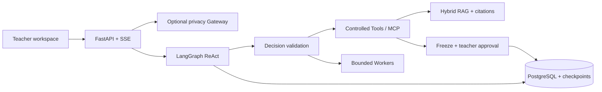

# EasyTeaching

EasyTeaching is a safety-aware AI agent for Australian early childhood educators. It combines a LangGraph ReAct loop, controlled Tools and Workers, hybrid RAG, PostgreSQL-backed memory and approval-gated record operations in a local teacher workspace.

The repository contains the application, migrations, synthetic/public evaluation data and automated tests. Use only synthetic, public or thoroughly de-identified data: the local privacy model is experimental and has not passed its release gate.

## Highlights

- **One ReAct assistant:** selects a single Tool, concurrent Tools, dependent actions or bounded parallel Workers one step at a time.
- **Evidence-backed support:** retrieves EYLF, NQF/NQS and synthetic centre-policy evidence with citations and hard source-scope filters.
- **Teacher-controlled records:** drafts observation and educational records, freezes validated write arguments and waits for explicit approval.
- **Conversation continuity:** combines recent turns, compressed context, draft metadata and scoped teacher/class long-term memory.
- **Operational recovery:** persists sessions, LangGraph checkpoints and replayable SSE lifecycle events in PostgreSQL.
- **Optional integrations:** supports a local Qwen privacy Gateway and authorised Google Drive search/upload through MCP.

Core product scope includes **Activity planning drafts**, **Observation and educational records**, **Policy question answering with citations**, and **Family communication drafts**.

## Architecture



Main chooses only the next executable action; it does not create a fixed top-level plan. Code validates Tool permissions, trusted teacher/class scope, conflicts, budgets and approvals before execution. Workers receive smaller Tool allowlists and are reserved for independent deep-research branches.

The RAG path uses Chroma dense retrieval and persistent SQLite FTS5/BM25, then combines ranks with RRF. Standard mode uses fast Hybrid retrieval; deep mode adds query rewriting, multi-query fusion and a local Cross-encoder reranker.

## Repository layout

```text
app/             Agent, API, services, Tools, web UI and workflows
safety_gateway/  Local Qwen service, deterministic rules and mapping vault
data/            Public/synthetic knowledge and frozen evaluation cases
evals/           Evaluation runners, metrics and reliability checks
migrations/      Alembic migrations
scripts/         Setup, indexing, evaluation and operation commands
tests/           Unit, contract and integration tests
docs/            Detailed architecture and operational documentation
```

## Quick start

Requirements: Python 3.10+, Docker Desktop, and chat/embedding provider credentials. Google Drive, Supabase authentication and the local privacy Gateway are optional.

### Windows PowerShell

```powershell
py -m venv .venv
.\.venv\Scripts\Activate.ps1
python -m pip install -r requirements.txt
Copy-Item .env.example .env
docker compose up -d postgres
.\.venv\Scripts\alembic.exe upgrade head
.\.venv\Scripts\python.exe scripts\run_api.py
```

### macOS / Linux

```bash
python3 -m venv .venv
source .venv/bin/activate
pip install -r requirements.txt
cp .env.example .env
docker compose up -d postgres
alembic upgrade head
python scripts/run_api.py
```

Edit `.env` before starting: use the same PostgreSQL password in `POSTGRES_PASSWORD`, `DATABASE_URL` and `CHECKPOINT_DATABASE_URL`, then configure the chat and embedding credentials. Keep optional integrations disabled until their setup is complete.

Open <http://127.0.0.1:8000>. API documentation is at <http://127.0.0.1:8000/docs> and health status at `GET /health`.

## Knowledge setup

```powershell
python scripts\ingest_knowledge.py --output data\knowledge\processed\chunks.jsonl
python scripts\build_lexical_index.py
python scripts\build_vector_index.py --reset --batch-size 5
python scripts\query_vector_index.py `
  "What does the EYLF say about play-based learning?" `
  --mode hybrid --top-k 5
```

Ingestion and BM25 indexing are local. Dense indexing and dense/hybrid queries consume embedding API quota. The frozen corpus contains 2,087 chunks with stable source, title, section and page metadata.

The knowledge Tool enforces `eylf`, `nqs`, `centre_policy` or `all` scopes:

- `mode=standard`: one Hybrid retrieval for focused questions.
- `mode=deep`: query rewrite, multi-query retrieval and Cross-encoder reranking for broad or cross-document research.

## API and controlled writes

1. `POST /sessions` creates a durable conversation.
2. `POST /sessions/{session_id}/messages` accepts an idempotent request.
3. `GET /sessions/{session_id}/events` replays ordered SSE progress events.
4. `GET /sessions/{session_id}/drafts/{request_id}` returns a draft and citations.
5. `POST /sessions/{session_id}/approvals` approves or rejects one frozen action.

SSE streams persisted Agent lifecycle events rather than individual LLM tokens. Saving records, exporting files and Google Drive uploads cannot execute during model generation: reviewed arguments are frozen and run only after approval. External message sending is not implemented.

## Safety boundary

| Level | Example | Behavior |
| --- | --- | --- |
| L0 read-only | Policy or synthetic class context | Execute with scoped evidence |
| L1 draft | Activity, record or family-message draft | Mark as reviewable draft |
| L2 controlled write | Save, export or upload a record | Freeze and require approval |
| L3 forbidden or handoff | Diagnosis, medical/legal conclusion, sending | Refuse or hand off |

EasyTeaching must not **Diagnose children**, provide **medical advice** or **legal compliance conclusions**, or **Send real messages to families**. Human approval is required for every L2 controlled write.

The optional local Gateway combines deterministic policy with a Qwen2.5-1.5B QLoRA annotation model. Python owns blocking, placeholders, one-time mappings and restoration. The current vault is memory-only and single-process; real personal data requires a passed Gateway release gate, durable encrypted mappings, multi-tenant identity, retention controls and formal privacy review.

See [Local Safety Gateway](docs/local-safety-gateway.md) for setup and detailed deployed-pipeline results.

## Testing and evaluation

```powershell
# Complete zero-provider-cost regression suite
python -m pytest

# Structural and reliability checks
python scripts\run_evals.py
python scripts\run_reliability_checks.py

# Frozen RAG benchmark; dense/hybrid modes use embedding quota
python scripts\run_rag_evals.py `
  --cases data\evals\rag_final_cases.json `
  --split test --modes bm25 dense hybrid `
  --report reports\rag_final_report.json

# Production-path Agent evaluation; uses chat and embedding quota
python scripts\run_final_agent_suite.py `
  --output reports\final_agent_evaluation_v2.json
```

Latest frozen results:

| Evaluation | Result |
| --- | --- |
| Regression suite | `331/331` passed |
| Production-path Agent | `93/100` scenarios across `118` turns |
| Required-Tool recall / Tool precision | `98.0% / 92.8%` |
| Hybrid + Cross-encoder RAG, 40 questions | Recall@3 `97.5%`, MRR `0.869`, nDCG@10 `0.902` |
| RAG citation correctness / scope violations | `100% / 0%` |
| Direct Qwen model, 1,227 raw-input cases | Injection Macro-F1 `95.2%`, block recall `97.7%` |
| Direct Qwen PII precision / recall / F1 | `98.5% / 93.9% / 96.1%` |
| Direct Qwen labelled-entity leakage / release gate | `5.5% / failed` |

The Agent evaluation uses synthetic scenarios and deterministic weather/Drive adapters. The RAG set uses one manually selected exact gold chunk per question. The direct-model benchmark excludes regex/rule assistance and measures the model rather than the deployed Gateway. Detailed methods and failures are in [Agent evaluation](docs/agent-evaluation.md), [RAG system](docs/rag-system.md) and [Local Safety Gateway](docs/local-safety-gateway.md).

## Current limitations

- The local privacy model and deployed Gateway have not passed their release gates.
- Authentication is optional and disabled by default; production requires centre isolation, roles, retention policy and security review.
- Multi-instance deployment still needs shared ephemeral state, rate limiting, background jobs, monitoring, backups and load testing.
- All included child, family, teacher and centre examples are synthetic.

See [Project status](docs/project-status.md) for implemented scope and remaining work.

## Documentation

- [Architecture](docs/architecture.md)
- [Tool and Worker architecture](docs/tool-architecture.md)
- [RAG system](docs/rag-system.md)
- [API and operations](docs/api-and-operations.md)
- [Engineering decisions](docs/engineering-decisions.md)
- [Project status](docs/project-status.md)

## License

Source code is provided under the [MIT License](LICENSE). Bundled official education documents retain their original ownership and terms. The application is not a substitute for professional, legal or regulatory advice.
