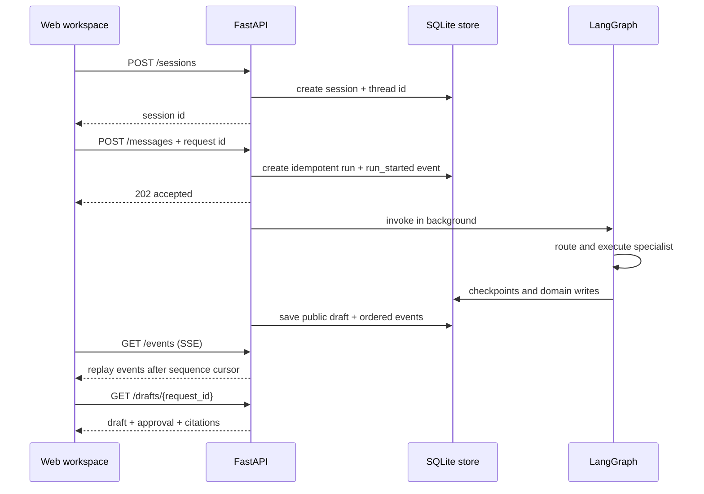

# Architecture

This document explains how EduFlow's modules cooperate without repeating the
implementation history kept in Git.

## Request lifecycle



## Layers and responsibilities

### `app/api`

The transport layer. Route modules validate HTTP requests and delegate work.
`runtime.py` builds one shared store, checkpointer, and compiled graph for the
FastAPI lifespan. `execution.py` converts graph outcomes into public run state,
results, and replay-safe events. API modules should not contain specialist
prompt logic or retrieval algorithms.

### `app/workflows`

The orchestration layer. `main_graph.py` owns the high-level path from context
loading to intent routing, specialist invocation, context update, and memory
update. Specialist workflows own private state and return a common
`SpecialistResult`, which prevents the main graph from depending on every
specialist's internal fields.

### `app/agents`

Model-driven decision makers. The intent router chooses a supported workflow.
The Planning ReAct agent decides which controlled tool to request next; the
executor validates and performs the request. Agents propose actions, but do not
gain authority merely by naming a function.

### `app/tools` and `app/skills`

Tools are code capabilities with Pydantic input/output contracts, risk levels,
permissions, and handlers. `ToolRegistry` is the enforcement point. Skills are
trusted local Markdown/JSON instructions. Loading a Skill changes the workflow
guidance and required tools, but cannot expand the specialist's code-level
permission policy.

### `app/services`

Reusable infrastructure and domain operations: SQLAlchemy persistence, model
provider calls, retry policy, embeddings, knowledge ingestion/retrieval,
redaction, context compaction, and long-term memory extraction. These modules
do not know about HTML or browser state.

### `app/schemas`

The shared contract layer. Pydantic models make invalid state fail at a named
boundary instead of leaking loosely shaped dictionaries across the system.
Graph state, public API payloads, specialist input/output, tool results, and
knowledge citations live here.

### `app/web`

A dependency-free local client served by FastAPI. It only talks to public HTTP
routes and SSE, so it exercises the same runtime as curl or another future
frontend. Browser-only recent-conversation labels are stored locally; durable
session and workflow state stays in the backend.

### `evals`, `data/evals`, and `scripts`

Evaluation code is intentionally outside `app/`: it measures production logic
but is not imported by the API. JSON manifests describe cases and failure
scenarios, while small script entry points make them runnable from a terminal.

## State is stored at different levels

| State | Location | Purpose |
| --- | --- | --- |
| Graph checkpoint | SQLite checkpointer | Resume the exact LangGraph thread |
| API session/run/event | SQLAlchemy SQLite store | Idempotency, status, SSE replay |
| Short-term context | Graph state | Bounded recent turns and compact summary |
| Long-term memory | SQLAlchemy SQLite store | Scoped teacher/class preferences and recall |
| Vector knowledge | Chroma | Searchable policy/source chunks |
| UI labels | Browser local storage | Convenience-only recent conversation names |

These are not duplicate copies of one object. Each representation serves a
different recovery, security, or product boundary.

## Dependency direction

Prefer dependencies pointing inward:

```text
web -> public API -> workflow -> agent/tool/service -> schema/domain contract
```

Evaluation code may import production modules, but production code must not
import `evals`. Specialist-private state must not leak into route handlers, and
browser code must not access SQLite or LangGraph directly.
