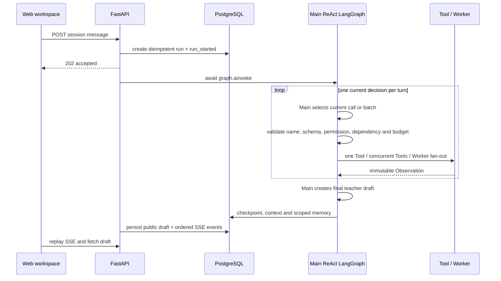

# Architecture

EasyTeaching 的生产 Runtime 只使用一条统一 Main ReAct 主线。旧 Intent Router、固定
Specialist、Skill、审批图和同步单 Tool ReAct 已删除。

## Request lifecycle



Main 不预先生成完整执行计划。每一轮只选择当前一个调用或当前可以安全并行的
批次；有依赖的调用等待 Observation 后由下一轮重新决定。

## Production graph

```text
initialize
  → main_react
  → validate_decision
      ├─ single_tool
      ├─ parallel_tools
      ├─ run_worker (LangGraph Send fan-out)
      ├─ decision_feedback
      ├─ clarification
      └─ finalize_draft

single/parallel/worker/feedback
  → merge_observations
  → main_react

finalize_draft/clarification
  → context_update
  → long_memory_update
  → END
```

只有 Main 可以产生教师可见草稿。Tool、MCP 适配器和 Worker 只能返回
Observation，不能直接写主 State 或执行业务副作用。

## Execution choices

| 当前需要 | 执行方式 |
| --- | --- |
| 一个普通或单一深度任务 | Main 跨多轮调用一个 Tool |
| 多个独立简单查询 | `parallel_tools` 内异步并发 |
| 多个独立深度研究 | 固定 Worker Profile 并行 fan-out |
| 有依赖或独立性不确定 | 先执行一个前置调用，下一轮继续 |
| 信息足够 | 结束循环并生成草稿 |

三个 Worker Profile 分别限制为内部政策/EYLF、本地 teacher-scoped 上下文、
以及去身份化公开信息。它们有独立模型上下文、固定工具白名单和最大 3 轮预算。

## Code boundaries

### `app/api`

负责认证、session ownership、幂等、session busy、公开结果、SSE replay 和恢复。
生产 Runtime 只接受 PostgreSQL，使用 `AsyncPostgresSaver`、异步 SQLAlchemy
Store 和 `await graph.ainvoke()`。API、恢复、SSE 查询、模型 HTTP 和外部 HTTP
工具均通过原生 `await`，不再把整张图放入工作线程。

### `app/workflows/main_react_graph.py`

负责节点、条件边、Worker `Send`、Observation reducer、安全合并和循环预算。
并行分支不共享可变字典，只向 `pending_observations` 追加；唯一 merge 节点更新
主 Observation map。

### `app/agents`

`MainReActAgent` 只提出结构化当前决定；`MainDecisionValidator` 用代码重做权限、
依赖、隐私字段、并发安全和重复调用检查；`BoundedWorkerRunner` 在小上下文内运行
受限 ReAct。

### `app/tools`

`ToolRegistry` 是真实执行边界。每个 Tool 包含 Pydantic 输入/输出、领域、风险、
权限、超时和并发标记。可信 `teacher_id/class_id` 由图注入，模型参数不能扩大
本地读取范围。

### `app/services`

保留 SQLAlchemy Store、模型 Provider/retry、Chroma + BM25 hybrid RAG、reranker、
引用、短上下文压缩和长期记忆。它们是普通 Python 模块，不被隐藏到图框架中。

## State and persistence

| State | Location | Purpose |
| --- | --- | --- |
| Graph checkpoint | LangGraph AsyncPostgresSaver | 恢复精确节点和同一 thread |
| API session/run/event | SQLAlchemy PostgreSQL | 幂等、状态和 SSE replay |
| Current ReAct state | GraphState | 当前决定、Observation、预算和 trace |
| Short context | checkpointed GraphState | 有界 recent turns 和摘要 |
| Long-term memory | SQLAlchemy PostgreSQL | teacher/class scoped durable memory |
| Knowledge index | Chroma + BM25 | 政策与 EYLF 检索 |

同一个 checkpoint thread 会跨消息保留 context，但 `initialize` 为每个新
`request_id` 重置临时 Observation、计数和重复调用记录，并记录本轮 trace/citation
起点，避免 SSE 重放上一轮运行数据。

## Current safety boundary

生产主图只生成草稿，不保存学习记录、不发送消息、不进入审批，也不执行其他
副作用。旧审批 API 已移除。真实儿童数据的本地隐私模型和可逆映射仍是后续
项目；在此之前只允许测试或彻底脱敏数据。
